# Farm

Farm management project

## Author

- [Đoàn Quang Huy](https://github.com/quanghuybest2k2)
- [Phạm Ngọc Hưng](https://github.com/Hung-Alex)

## Installation

- [Frontend](./src/frontend/README.md)
- [Backend](./src/backend/README.md)
- [Mobile](./src/farm-app/README.md)

## Demo Image

### IoT device

## WEB

### Dashboard

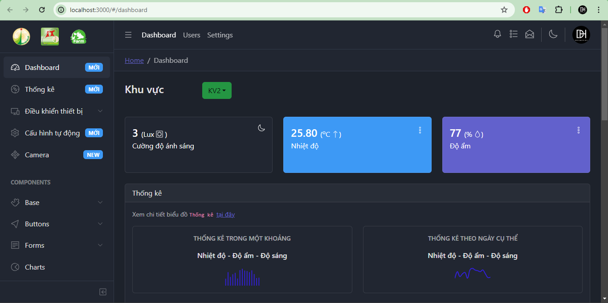
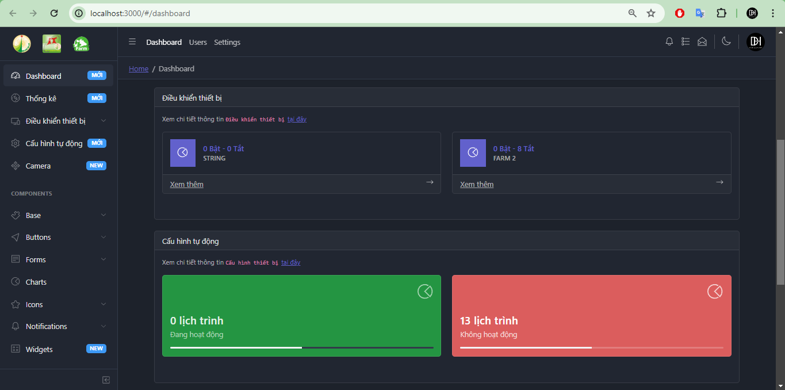

### Statistics

#### Statistics from start date to end date

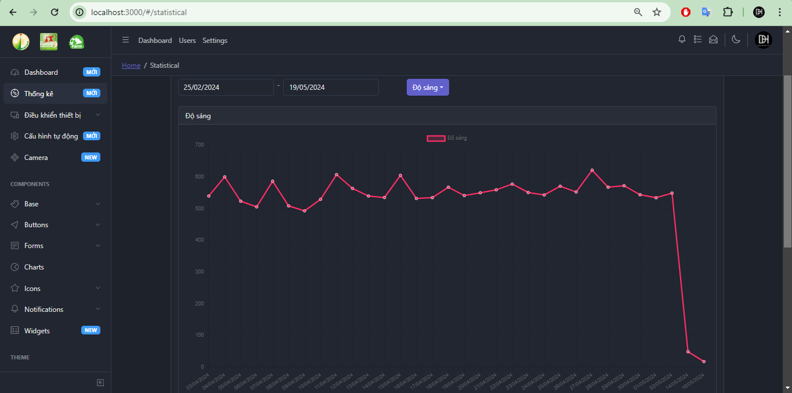

#### Temperature statistics by specific day

#### Humidity statistics by specific day

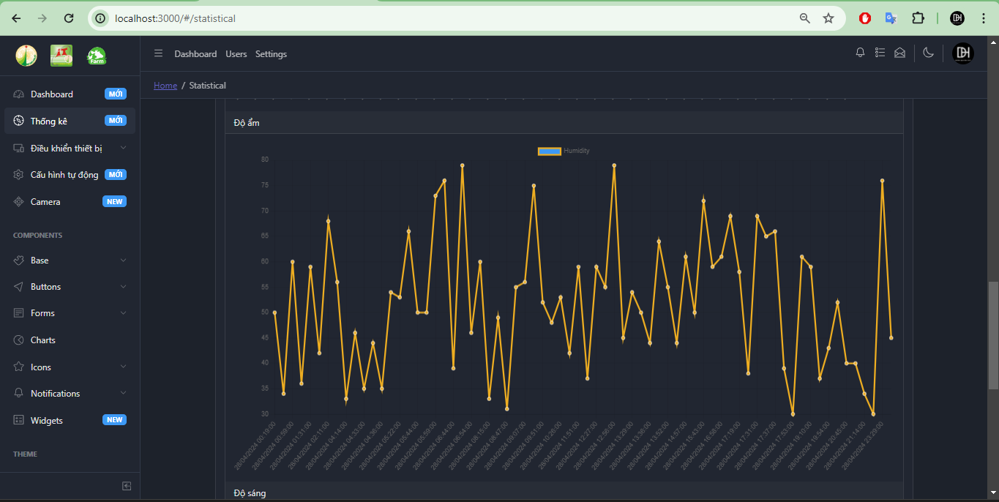

#### Brightness statistics by specific day

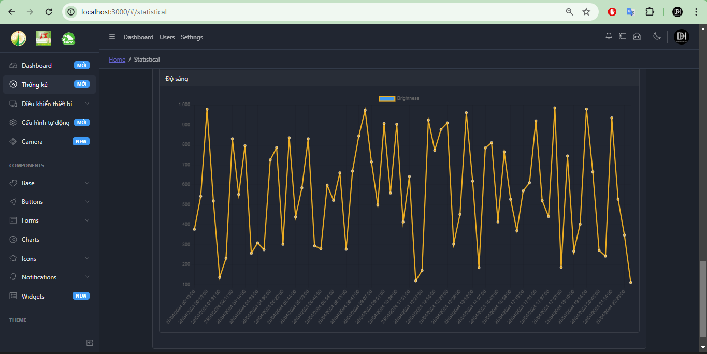

### Control device

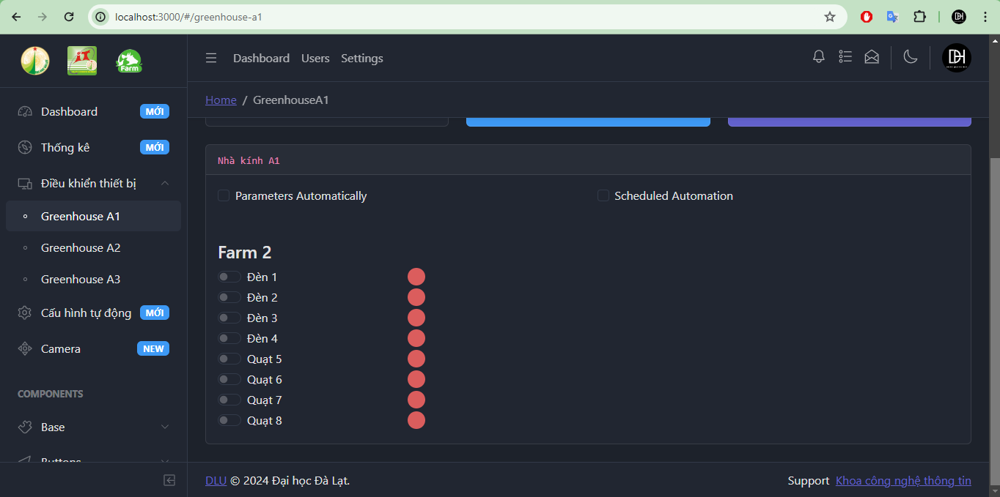

### Schedule

#### List

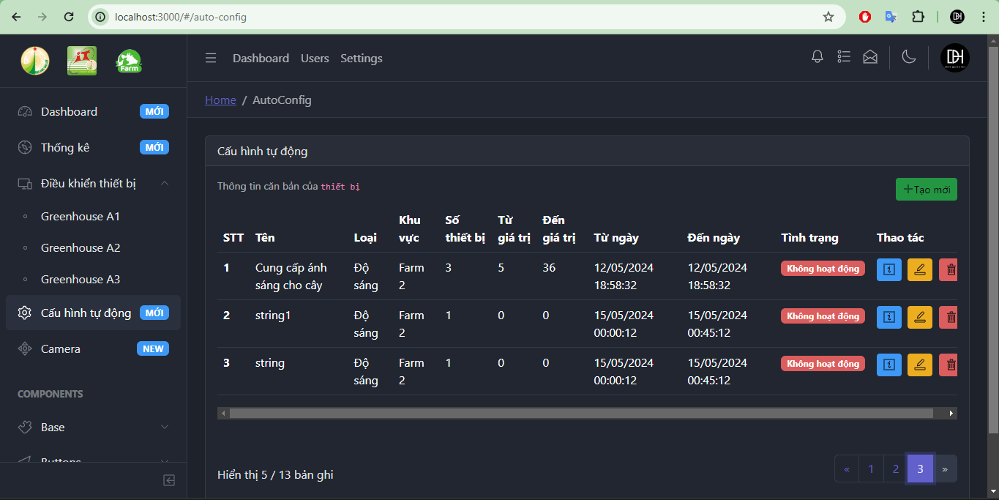

#### Detail

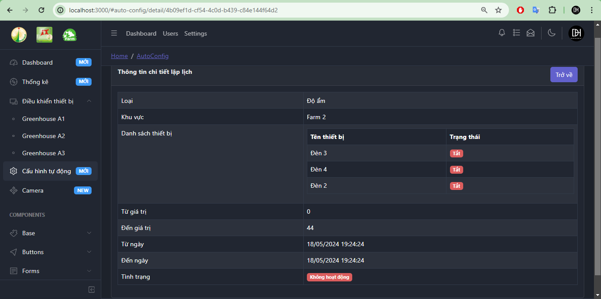

#### Create

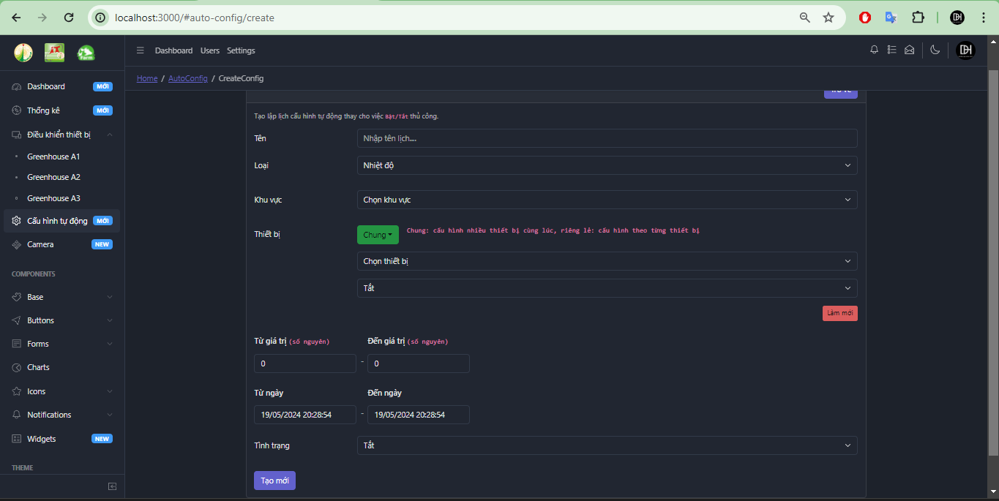

#### Edit

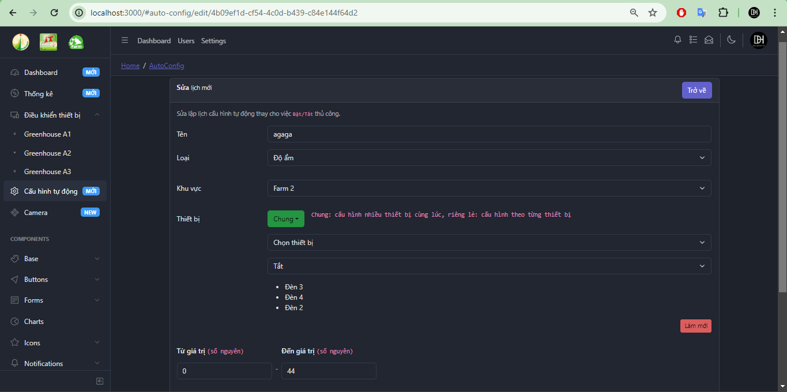

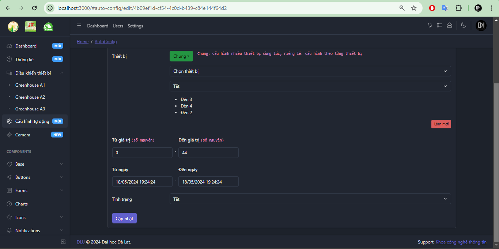

#### Delete

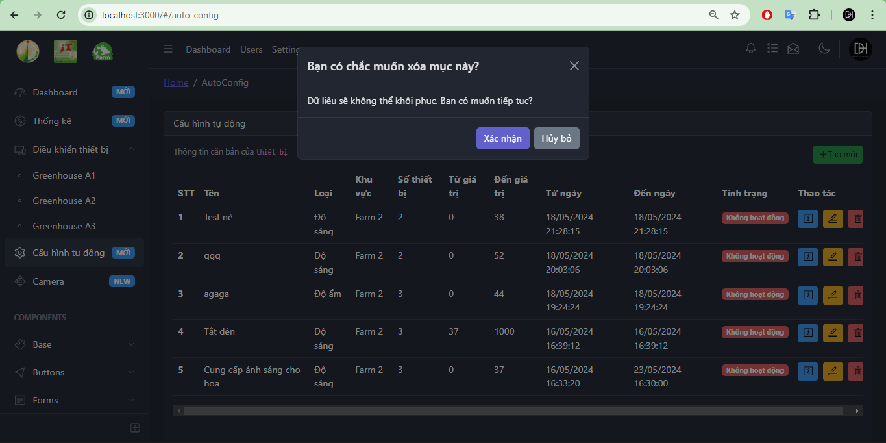

## MOBILE

### Dashboard

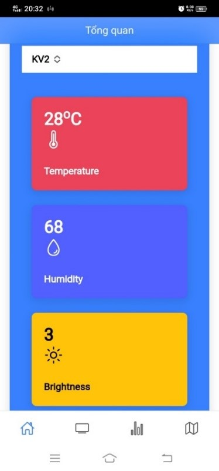

### Control device

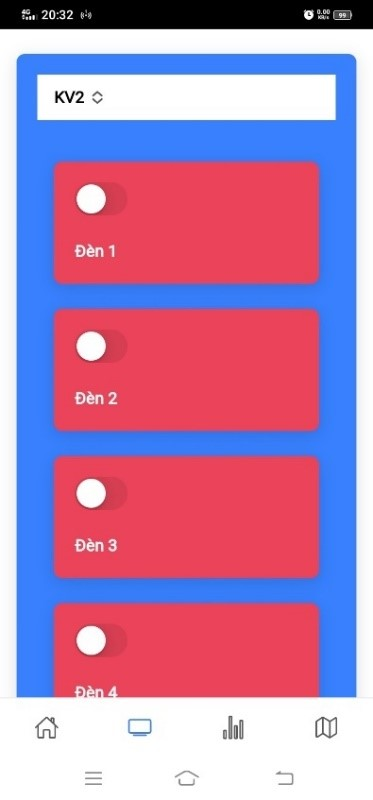

### Statistics

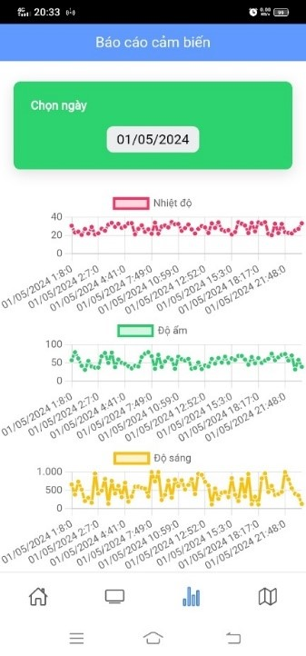

### Maps

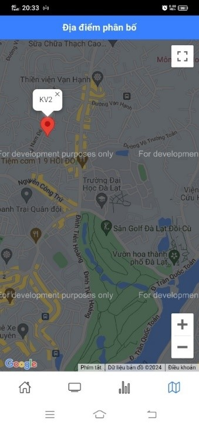

## License

This project is licensed under the [MIT License](https://github.com/quanghuybest2k2/Farm/blob/main/LICENSE).
